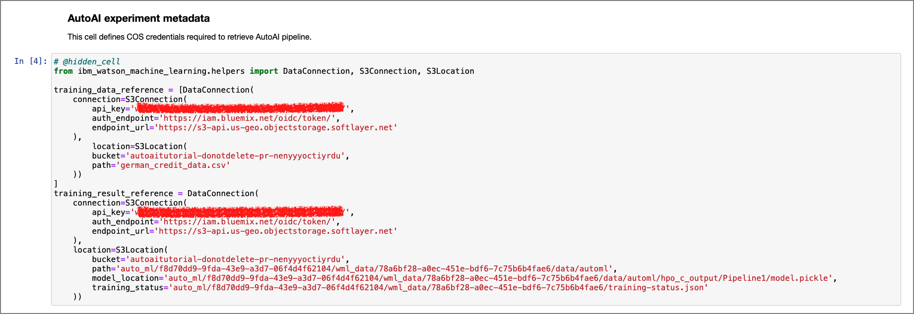

# Generate Python notebook for pipeline models using AutoAI

## Summary

In this code pattern, we will learn how to automatically generate a Jupyter notebook that will contain Python code of a machine learning model using AutoAI. We will explore, modify and retrain this model pipeline using python code. Lastly, we will deploy this model in Watson Machine Learning using WML APIs.

## Description

AutoAI is a graphical tool available within Watson Studio that analyzes your dataset, generates several model pipelines  and ranks them based on the metric chosen for the problem. This code pattern shows extended features of AutoAI. More basic AutoAI exploration for the same dataset is covered in the [Generate machine learning model pipelines to choose the best model for your problem](https://developer.ibm.com/tutorials/generate-machine-learning-model-pipelines-to-choose-the-best-model-for-your-problem-autoai/) article.

When you have completed this code pattern, you will understand how to:

* Run an AutoAI experiment.
* Generate and save a Python notebook.
* Execute notebook and analyse results.
* Make changes and retrain model using Watson Machine Learning SDKs.
* Deploy model using Watson Machine Learning from within notebook .

## Architecture components

## Flow

1. The user submits an AutoAI experiment using default settings.
1. Multiple pipeline models are generated. A pipeline model of choice from the leaderboard is saved as Jupyter notebook.
1. The Jupyter notebook is executed and a modified pipeline model is generated within the notebook.
1. Pipeline model is deployed in Watson Machine Learning using WML APIs.

## Included components

* [IBM Watson Studio](https://cloud.ibm.com/catalog/services/watson-studio) - IBM Watson® Studio helps data scientists and analysts prepare data and build models at scale across any cloud.
* [IBM Watson Machine Learning](https://cloud.ibm.com/catalog/services/machine-learning) - IBM Watson® Machine Learning helps data scientists and developers accelerate AI and machine-learning deployment.

## Featured Technologies

* [Machine Learning](https://developer.ibm.com/articles/introduction-to-machine-learning/) - Science of predicting values by analysing historic data.
* [Python](https://www.python.org/) - Python is an interpreted, object-oriented, high-level programming language.
* [Jupyter notebook](https://jupyter.org/) - Open-source web application to help build live code.
* [scikit-learn](https://scikit-learn.org/stable/) - Python based machine learning library.
* [lale](https://github.com/IBM/lale) - Python library compatible with scikit-learn for semi-automated data science used in AutoAI SDK

## Prerequisites

* [IBM Cloud account](https://tinyurl.com/y4mzxow5) This code pattern assumes you have an **IBM Cloud** account. Sign up for a no-charge trial account - no credit card required.

> Instructions to get through the list of prerequistes are covered in [this](https://developer.ibm.com/technologies/artificial-intelligence/tutorials/generate-machine-learning-model-pipelines-to-choose-the-best-model-for-your-problem-autoai/) prequel.

* Create a Cloud Object Storage service instance.
* Create a Watson Studio service instance.
* Create a Watson Machine Learning service instance.
* Create a Watson Studio project and load data.

## Steps

### 1. Run AutoAI experiment

1. Open the project created within Watson Studio. Click `Add to  project +` button on the right top and then click `AutoAI Experiment`.
1. Give the experiment a name(*Credit Risk Analysis*), associate a Watson Machine Learning service from the drop down and click `Create`.
1. On the *Add data source* screen, click `Select from project` and check *german_credit_data.csv* and click `Select asset`.
1. Under the *Configure details* section, Click on the `What do you want to predict?` drop down and select `Result` from the list. If you are using a different dataset, select the column that you want AutoAI to run predictions on. Click `Run experiment` on the right bottom.

You will see a notification that indicates *AutoAI experiment has started*. Depending on the size of the data set, this step will take a few minutes to complete.

### 2. Generate experiment level notebook

The `experiment notebook` provides annotated code so you can:

* Interact with trained model pipelines
* Access model details programmatically (including feature importance and machine learning metrics)
* Visualize each pipeline as a graph, with each node documented, to provide transparency
* Download selected pipelines and test locally
* Create a deployment and score the model
* Get the experiment configuration, which you can use for automation or integration with other applications

To generate an experiment notebook, perform the following steps :

1. Once the AutoAI experiment completes, click on the `Save experiment code` button indicated by the floppy icon.

    

1. In the `Save experiment code` prompt, modify the default *Name* if needed and click `Save`. A pop up will show up that indicates that the notebook was saved successfully. You will now see this notebook under the *Notebooks* section within the the *Assets* tab.

#### 2.0 Load and execute notebook  

Spend some time looking through the sections of the notebook to get an overview.
 A notebook is composed of text (markdown or heading) cells and code cells. The markdown cells provide comments on what the code is designed to do.

You will run cells individually by highlighting each cell, then either click the `Run` button at the top of the notebook or hitting the keyboard short cut to run the cell (Shift + Enter but can vary based on platform). While the cell is running, an asterisk ([*]) will show up to the left of the cell. When that cell has finished executing a sequential number will show up (i.e. [17]). * 

The notebook generated is pre filled with Python code and is divided into 4 main sections as follows.

#### 2.1 Setup

This section contains credentials to *Cloud Object Storage* through which the current AutoAI pipeline is retrieved. The cell contains code prefilled to extract the training data used to create the pipeline and the pipeline results.

Also this section contains the metadata of the current pipeline that were used to run the experiment.

##### api_key

To be able to access the WML instance, the user will need to generate an *api key* through the cloud account and paste it in the cell as shown in the cell below. The instructions to acquire the *cloud api key* is described in the markdown section of the screenshot shown below.

#### 2.2 Pipelines comparison

To compare all the pipelines that gets generated, call the `summary()` method on the pipeline object. The best performing model is stored under the `best_pipeline_name` variable

By passing the variable name within the `get_pipeline()` method, all the feature importance generated with that particular pipeline is listed.

#### 2.3 Inspect pipeline

Within this section of the notebook, there is code to visualize the stages within the model as graph using Watson Machine Learning's AutoAI APIs.

This section also contains code that extracts the current model and prints it as Python code.

#### 2.4 Deploy and score as web service using WML instance

This section of the notebook contains code that deploys the pipeline model as a web service using Watson Machine Learning. This section requires users to enter credentials to be able to identify the right WML instance and deployment space.

##### target_space_id

>*To create a deployment space and get the target_space_id*:

>
>1. Click on the hamburger menu on the top-left corner of the Watson Studio home page.
>1. Click on `Deployment Spaces` from the list and select `View all spaces`
>1. Click `New deployment space`, select `Create an empty space` option.
>1. Provide a name, select a machine learning service that was previously created and click `Create`
>1. Click `View new space` and switch to the `Settings` tab and copy the `space id`

Acquire the *target_space_id* as shown in the steps above and paste within the create deployment section. The Watson Machine Learning API uses the `wml_credentials` and the `target_space_id` to deploy the machine learning model as a web service.

Once the cells are executed, the model is promoted to the deployment space and is now available as a web service and can be verified from within the UI as shown below.

#### Score web service

Scoring the web service can either be done from the UI by switching to the `test` tab shown in the screenshot above. Alternatively, the *score()* method from the WML API can be be used to submit a sample test payload. The results are returned as shown in the screenshot below.

### 3. Generate pipeline level notebook

The `pipeline notebook` provides annotated code that allow you to:

* View the Scikit-learn pipeline definition
* See the transformations applied for pipeline training
* Preview hyper-parameters values found in HPO phase
* Review the pipeline evaluation
* Refine the pipeline definition
* Re-fit and re-evaluate

To generate a pipeline notebook, perform the following steps :

1. Hover over the pipeline that you wish to save as notebook and click on the `Save as` dropdown on the right side and select `Notebook` from the drop down.

1. In the `Save as` prompt, you will notice that there are two types of assets that can be generated, namely *Model* and *Notebook*.  We will select the `Notebook` option.  

1. From the `Define details` section on the right, change the default *Name* if needed and click `Create`. A pop up will show up that indicates that the notebook was saved successfully. You will now see this notebook under the *Notebooks* section within the the *Assets* tab.

Edit and execute each of the cells as shown in section `2.0`. The note contains more information in its markdown cells.

## Related Links

* [Simplify your AI lifecycle with AutoAI](https://developer.ibm.com/series/explore-autoai/)

## License

This code pattern is licensed under the Apache License, Version 2. Separate third-party code objects invoked within this code pattern are licensed by their respective providers pursuant to their own separate licenses. Contributions are subject to the [Developer Certificate of Origin, Version 1.1](https://developercertificate.org/) and the [Apache License, Version 2](https://www.apache.org/licenses/LICENSE-2.0.txt).

[Apache License FAQ](https://www.apache.org/foundation/license-faq.html#WhatDoesItMEAN)
