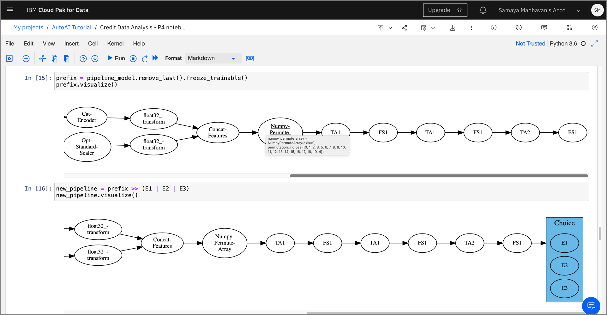
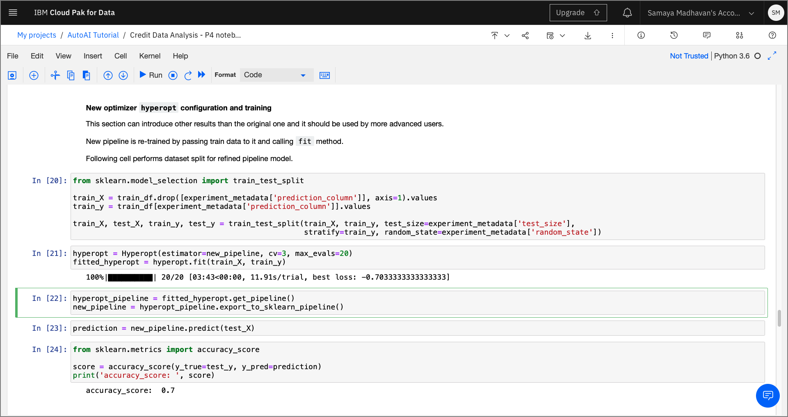
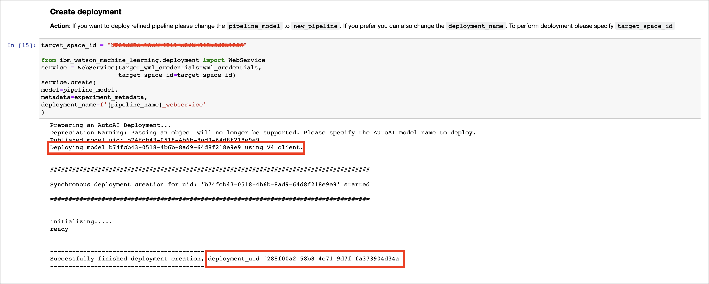

<!-- Add a new Title and fill in the blanks -->
# Generate Python notebook for pipeline models using AutoAI

## Summary

In this code pattern, we will learn how to automatically generate a jupyter notebook model through AutoAI. We will explore, modify and retrain this model pipeline using python code. Lastly, we will deploy this model in Watson Machine Learning using WML APIs.

## Description

AutoAI is a graphical tool available within Watson Studio that analyzes your dataset, generates several model pipelines  and ranks them based on the metric chosen for the problem. This code pattern shows extended features of AutoAI. More basic AutoAI exploration for the same dataset is covered in the [Generate machine learning model pipelines to choose the best model for your problem](https://developer.ibm.com/tutorials/generate-machine-learning-model-pipelines-to-choose-the-best-model-for-your-problem-autoai/) article.

When you have completed this code pattern, you will understand how to:

* Run an AutoAI experiment.
* Generate and save a Python notebook.
* Execute notebook and analyse results.
* Improvise pipeline model and retrain using auto-generated notebook.
* Deploy model using Watson Machine Learning from within notebook .

## Architecture components
<!--add an image in this path-->

<!--Optionally, add flow steps based on the architecture diagram-->
## Flow

1. The user submits an AutoAI experiment using default settings.
1. Multiple pipeline models are generated. A pipeline model of choice from the leaderboard is saved as jupyter notebook.
1. The jupyter notebook is executed and a modified pipeline model is  generated within the notebook.
1. Pipeline model is deployed in Watson Machine Learning using WML APIs.

# Included components

* [IBM Watson Studio](https://cloud.ibm.com/catalog/services/watson-studio) - IBM Watson® Studio helps data scientists and analysts prepare data and build models at scale across any cloud.
* [IBM Watson Machine Learning](https://cloud.ibm.com/catalog/services/machine-learning) - IBM Watson® Machine Learning helps data scientists and developers accelerate AI and machine-learning deployment.

# Featured Technologies

* [Machine Learning](https://developer.ibm.com/articles/introduction-to-machine-learning/) - Science of predicting values by analysing historic data.
* [Python](https://www.python.org/) - Python is an interpreted, object-oriented, high-level programming language.
* [Jupyter notebook](https://jupyter.org/) - Open-source web application to help build live code.
* [scikit-learn](https://scikit-learn.org/stable/) - Python based machine learning library.
* [lale](https://github.com/IBM/lale) - Python library compatible with scikit-learn for semi-autmated data science used in AutoAI SDK

# Prerequisites

* [IBM Cloud account](https://tinyurl.com/y4mzxow5) This code pattern assumes you have an **IBM Cloud** account. Sign up for a no-charge trial account - no credit card required.

> Instructions to get through the list of prerequistes are covered in [this](https://developer.ibm.com/technologies/artificial-intelligence/tutorials/generate-machine-learning-model-pipelines-to-choose-the-best-model-for-your-problem-autoai/) prequel.

* Create a Cloud Object Storage service instance.
* Create a Watson Studio service instance.
* Create a Watson Machine Learning service instance.
* Create a Watson Studio project and load data.

# Steps

## 1. Run AutoAI experiment

1. Open the project created within Watson Studio. Click `Add to  project +` button on the right top and then click `AutoAI Experiment`.
1. Give the experiment a name(*Credit Risk Analysis*), associate a Watson Machine Learning service from the drop down and click `Create`.
1. On the *Add data source* screen, click `Select from project` and check *german_credit_data.csv* and click `Select asset`.
1. Under the *Configure details* section, Click on the `What do you want to predict?` drop down and select `Result` from the list. If you are using a different dataset, select the column that you want AutoAI to run predictions on. Click `Run experiment` on the right bottom.

You will see a notification that indicates *AutoAI experiment has started*. Depending on the size of the data set, this step will take a few minutes to complete.

## 2. Saving AutoAI generated notebook

Once the experiment has completed, the leaderboard has a ranked list of the pipelines that AutoAI has generated.

1. Hover over the pipeline that you wish to save as notebook and click on the `Save as` dropdown on the right side and select `Notebook` from the drop down.

1. In the `Save as notebook` prompt, you will notice that there are two types of notebooks that can be generated, namely *WML notebook* and *AutoAI_lib notebook*.  We will select the default `WML notebook` which as we will see will include content from the other notebook as well.  

1. Modify the default *Name* if needed and click `Save`. A pop up will show up that indicates that the notebook was saved successfully. You will now see this notebook under the *Notebooks* section within the the *Assets* tab.

## 3. Load and execute notebook

Spend some time looking through the sections of the notebook to get an overview. A notebook is composed of text (markdown or heading) cells and code cells. The markdown cells provide comments on what the code is designed to do.

You will run cells individually by highlighting each cell, then either click the `Run` button at the top of the notebook or hitting the keyboard short cut to run the cell (Shift + Enter but can vary based on platform). While the cell is running, an asterisk ([*]) will show up to the left of the cell. When that cell has finished executing a sequential number will show up (i.e. [17]).

The notebook generated is pre filled with Python code and is divided into 4 main sections as follows.

### 3.1 Setup

This section contains credentials to *Cloud Object Storage* through which the current AutoAI pipeline is retrieved. The cell contains code prefilled to extract the training data used to create the pipeline and the pipeline results.

Also this section contains the metadata of the current pipeline that were used to run the experiment.

### 3.2 Pipeline inspection

within this section of the notebook, there is code that extracts the current model and prints it as python code.

This section also contains code to visualize the stages within the model as graph using the Watsom Machine Learning's AutoAI APIs.

### 3.3 Pipeline refinery and testing

This optional section walks us through two different ways of editing and retraining the model generated from the chosen pipeline.

>**Convert Raw NBConvert cells to Code Cells** -
Since this section of the notebook is optional, these cells cannot be run by default. To execute these series of cells, highlight the cell, and click on the `Format` dropdown from the menu and change the selection from `Raw NBConvert` cell to `Code`.

#### Option 1 - Modify source code

By running the `pretty-print` function, a  code cell is inserted as shown below. This new cell contains the source code of the pipeline. This code can now be modified and re-trained to produce a new model.

#### Option 2 -  Use lale library for semi automated data science

By using the *hyperopt* optimizer provided by the *lale* framework, we see how an estimator modified as a graph can be trained and tested.

Since the framework is compatible with scikit-learn the output pipeline can be exported as a scikit-learn model using the `export_to_sklearn_pipeline` method.

## 4. Deploy and score as webservice using WML instance

This section of the notebook contains code that deploys the pipeline model as a web service using Watson Machine Learning. This section requires users to enter credentials to be able to identify the right WML instance and deployment space. The two credentials are `api_key` and `target_space_id`

### api_key

With Watson Machine Learning V4, the user no longer is needed to provide the username and password information to be able to access the WML instance. Instead, the user will need to generate an *api key*  through the cloud account and paste it in the cell as shown in the cell below. The instructions to acquire the *cloud api key* is described in the markdown section of the screenshot shown below.

### target_space_id

>*To create a deployment space and get the target_space_id*:

>
>1. Click on the hamburger menu on the top-left corner of the Watson Studio home page.
>1. Click on `Deployment Spaces` from the list and select `View all spaces`
>1. Click `New deployment space`, select `Create an empty space` option.
>1. Provide a name, select a machine learning service that was previously created and click `Create`
>1. Click `View new space` and switch to the `Settings` tab and copy the `space id`

Acquire the *target_space_id* as shown in the steps above and paste within the create deployment section. The Watson Machine Learning API uses the `wml_credentials` and the `target_space_id` to deploy the machine learning model as a webservice.

Once the cells are executed, the model is promoted to the deployment space and is now available as a web service and can be verified from within the UI as shown below.

### Score webservice

Scoring the webservice can either be done from the UI by switching to the `test` tab shown in the screenshot above. Alternatively, the *score()* method from the WML API can be be used  to submit a sample test payload. The results are returned as shown in the screenshot below. 

# Related Links

* [Simplify your AI lifecycle with AutoAI](https://developer.ibm.com/series/explore-autoai/)

<!-- keep this -->
## License

This code pattern is licensed under the Apache License, Version 2. Separate third-party code objects invoked within this code pattern are licensed by their respective providers pursuant to their own separate licenses. Contributions are subject to the [Developer Certificate of Origin, Version 1.1](https://developercertificate.org/) and the [Apache License, Version 2](https://www.apache.org/licenses/LICENSE-2.0.txt).

[Apache License FAQ](https://www.apache.org/foundation/license-faq.html#WhatDoesItMEAN)
